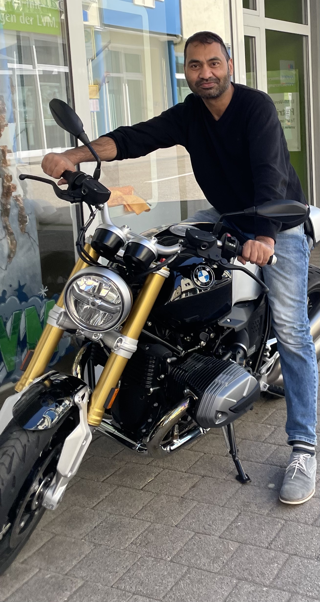

---
hide:
  - navigation
  - toc
---

# **Mushtaq Ali**
{ width=200 }

---

AI engineer with expertise in machine learning, deep learning, NLP, cheminformatics, and spatial omics. Proficient in Python, SQL, data science libraries, and GitHub, with experience in predictive modeling, generative AI, and bioinformatics applications.

---

- [Experience](./experience.md)
- [Skills & Tech-stack](./skills.md)
- [Projects Undertaken](./projects.md)
- [Education](./education.md)
- [Rewards & Recognitions](./recognition.md)
- [Interests & Hobbies](./interests.md)
- [About Me](./about.md)

---

{.md-social\_\_link .md-social}

